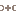

# Doctor's Website - Modern Medical Practice Site

A professional, elegant, and minimalistic website designed for a medical practice specializing in gastroenterology. Built with Astro for optimal performance and easy content management.



## Project Overview

This website provides a clean, professional online presence for a medical practice with the following features:

- **Modern, responsive design** that works seamlessly on all devices
- **Elegant visual language** with consistent styling and spacing
- **Patient-focused interface** with clear information architecture
- **Performance-optimized** for fast loading and SEO benefits

## Site Components

The site includes the following key sections:

- **Navbar**: Clean navigation with responsive mobile menu
- **Hero**: Professional introduction with call-to-action
- **About**: Doctor's credentials and experience
- **Specialties**: Medical specializations with icon-based cards
- **Treatments**: Available medical treatments with detailed descriptions
- **Blog Preview**: Latest articles in responsive grid/list layouts
- **Contact**: Contact information with embedded map
- **Footer**: Additional links and information

## Project Structure

```text
/
├── public/
│   ├── favicon.svg
│   └── logo.svg
├── src/
│   ├── assets/
│   │   ├── images and icons
│   ├── components/
│   │   ├── About.astro
│   │   ├── BlogPreview.astro
│   │   ├── Contact.astro
│   │   ├── Footer.astro
│   │   ├── Header.astro
│   │   ├── Hero.astro
│   │   ├── Navbar.astro
│   │   ├── Specialties.astro
│   │   ├── Treatments.astro
│   │   └── Welcome.astro
│   ├── layouts/
│   │   └── Layout.astro
│   └── pages/
│       └── index.astro
├── astro.config.mjs
├── package.json
├── tailwind.config.mjs
└── tsconfig.json
```

## Technology Stack

- **[Astro](https://astro.build/)**: Fast, modern static site generator
- **[Tailwind CSS](https://tailwindcss.com/)**: Utility-first CSS framework for rapid styling
- **Modern JavaScript/TypeScript**: For interactive components
- **Responsive Design**: Mobile-first approach with adaptive layouts
- **SVG Icons**: Lightweight, scalable icons for visual elements

## 🧞 Development Commands

All commands are run from the root of the project, from a terminal:

| Command                   | Action                                           |
| :------------------------ | :----------------------------------------------- |
| `pnpm install`            | Installs dependencies                            |
| `pnpm dev`                | Starts local dev server at `localhost:4321`      |
| `pnpm build`              | Build your production site to `./dist/`          |
| `pnpm preview`            | Preview your build locally, before deploying     |

## Design Features

- **Minimalistic aesthetics**: Clean design with ample white space
- **Consistent visual language**: Unified color scheme and styling
- **Accessible interface**: High-contrast text and intuitive navigation
- **Responsive layouts**: Content adapts gracefully to all screen sizes
  - Desktop: Multi-column grid layouts
  - Tablet: Adaptive layouts with adjusted spacing
  - Mobile: Single-column with optimized readability

## Deployment

The site can be deployed to any static hosting platform, including:

- Netlify
- Vercel
- GitHub Pages
- Any standard web hosting with HTML/CSS/JS support

## Content Management

Site content can be easily updated by modifying the Astro component files in the `src/components/` directory. Each section is self-contained with its own styles and markup.

---

Developed with ❤️ using Astro
